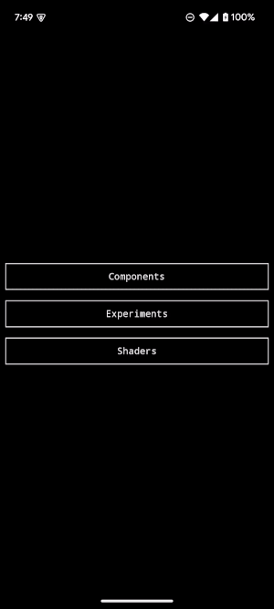

UiPlayground is a space for me to experiment with UI APIs, patterns, and tools within the [Jetpack Compose](https://developer.android.com/jetpack/compose) ecosystem. It contains both a library of UI components/shaders/etc. and an app to demonstrate the library.

## Demo App

[Source](app/src/main/kotlin/com/alexrdclement/uiplayground/)

## Components

[Source](components/src/main/kotlin/com/alexrdclement/uiplayground/components/)

### Media Control Sheet

Media Control Sheet is an interactive component that shows simple media information when collapsed and large-scale media artwork when expanded. It's inspired by similar components in the YouTube and YouTube Music apps.

### Media Control Bar

| 0%                                                                                                                                       | 50% | 100% |
|------------------------------------------------------------------------------------------------------------------------------------------| --- | ---- |
|  |  |  |

## Shaders

[Runtime Shaders](https://developer.android.com/reference/android/graphics/RuntimeShader) (introduced in Android 13) enable detailed control over how individual pixels are rendered on the screen. Below are shaders I've written, ported, or adapted as [Modifiers](https://developer.android.com/jetpack/compose/modifiers) that can be applied to any Composable that exposes a Modifier.

[Source](shaders/src/main/kotlin/com/alexrdclement/uiplayground/shaders/)

### Chromatic Aberration

[Chromatic Aberration](https://en.wikipedia.org/wiki/Chromatic_aberration) is a visual effect in which the colors of a light source are distorted to appear offset from their true position. The library's (_very_) loose approximation of the effect allows the red and blue color channels to be shifted in the X and Y directions by variable amounts.

| [0.0, 0.0] | [0.1, 0.0] | [0.2, 0.0] | [0.0, 0.1] | [0.0, 0.2] | [0.2, 0.2] |
| ---------- | ---------- | ---------- | ---------- | ---------- | ---------- |
| ].png>) | ].png>) | ].png>) | ].png>) | ].png>) | ].png>) |
| ].png>) | ].png>) | ].png>) | ].png>) | ].png>) | ].png>) |

### Pixelate

The Pixelate shader assigns the color of all pixels in a region to that of a sample point within the region. Below is the effect with an increasing number of additional pixels in each region.

| 0 | 5 | 10 | 25 | 50 | 100 |
| - | - | -- | -- | -- | --- |
|  |  |  |  |  |  |
|  |  |  |  |  |  |

### Noise

A simple noise effect with increasing levels of opacity.

| 0% | 20% | 50% | 100% |
| -- | --- | --- | ---- |
|  |  |  |  |
|  |  |  |  |

## Screenshot Tests

With the exception of the GIFs, the images above were captured as gold files for automated screenshot tests of the library. Screenshots are generated for each Pull Request and compared against these gold files to ensure UI changes are made intentionally and with review. These screenshot tests are powered by [Paparazzi](https://github.com/cashapp/paparazzi) and [TestParameterInjector](https://github.com/google/TestParameterInjector).

[Component Tests](components/src/test)

[Shader Tests](shaders/src/test)
