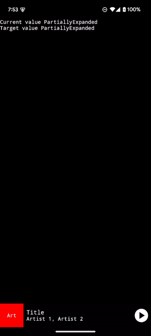

## Components

[Source](components/src/main/kotlin/com/alexrdclement/uiplayground/components/)

### Media Control Bar

| 0% | 50% | 100% |
| -- | --- | ---- |
|  |  |  |

### Media Control Sheet

## Shaders

[Source](shaders/src/main/kotlin/com/alexrdclement/uiplayground/shaders/)

### Chromatic Abberration

| [0.0, 0.0] | [0.1, 0.0] | [0.2, 0.0] | [0.0, 0.1] | [0.0, 0.2] | [0.2, 0.2] |
| ---------- | ---------- | ---------- | ---------- | ---------- | ---------- |
| ].png>) | ].png>) | ].png>) | ].png>) | ].png>) | ].png>) |
| ].png>) | ].png>) | ].png>) | ].png>) | ].png>) | ].png>) |

### Pixellate

| 0 | 5 | 10 | 25 | 50 | 100 |
| - | - | -- | -- | -- | --- |
|  |  |  |  |  |  |
|  |  |  |  |  |  |

### Noise

| 0% | 20% | 50% | 100% |
| -- | --- | --- | ---- |
|  |  |  |  |
|  |  |  | 

## Screenshot tests

[Components](components\src\test)

[Shaders](shaders\src\test)